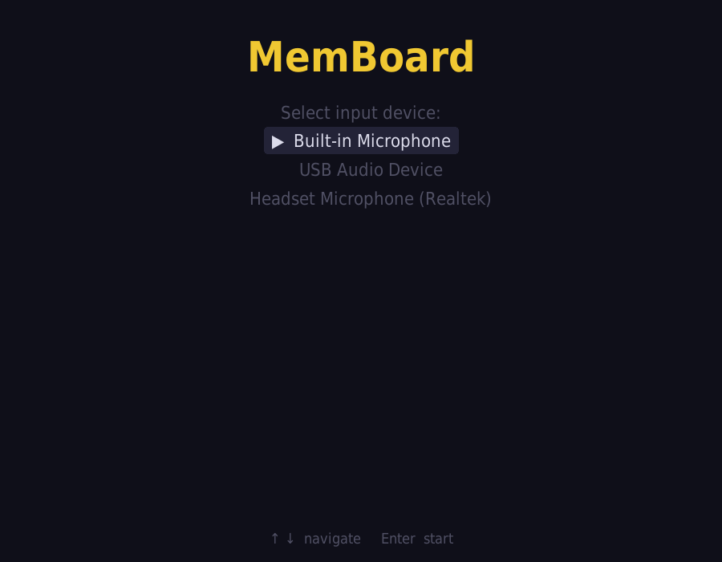
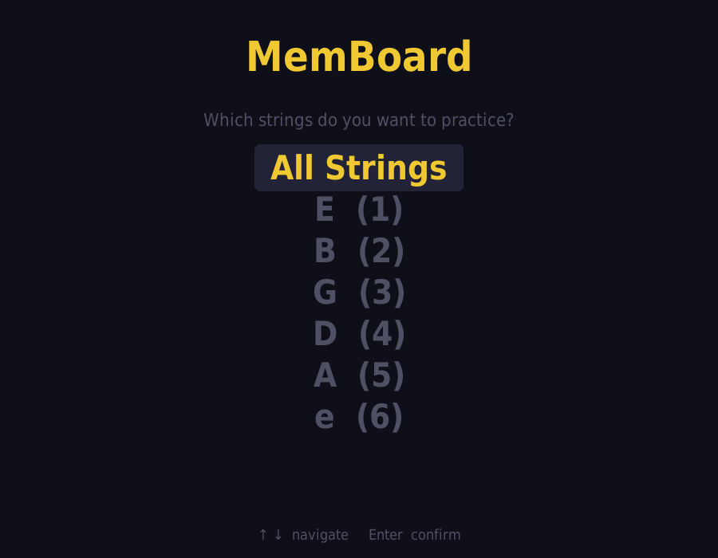
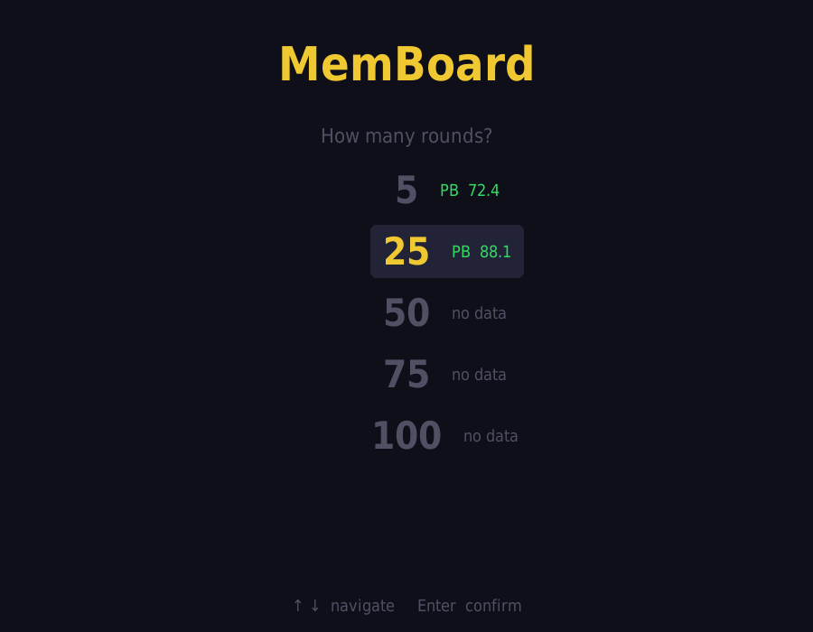
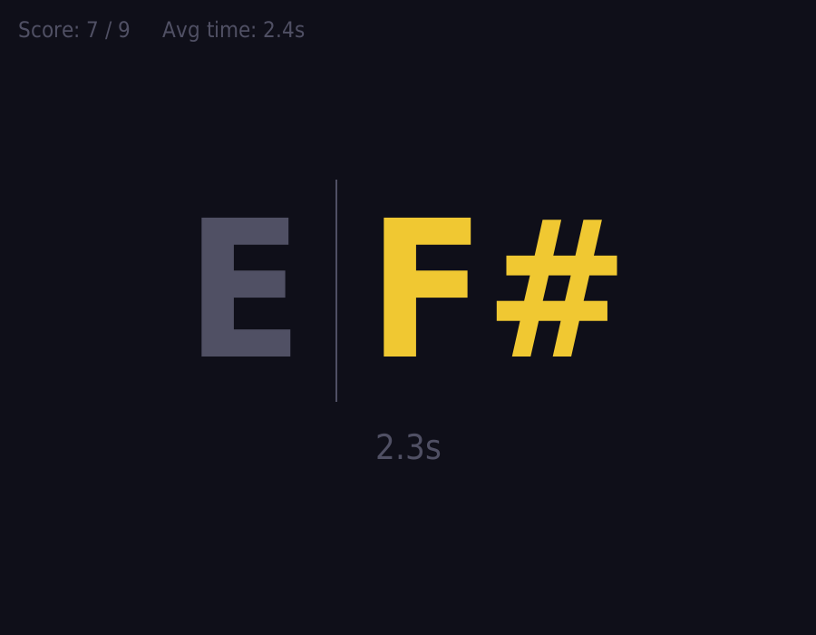
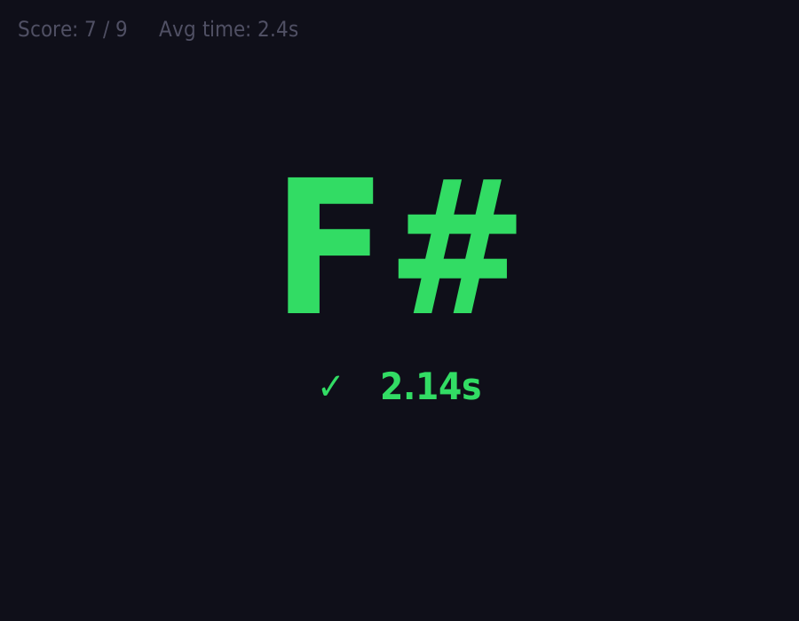
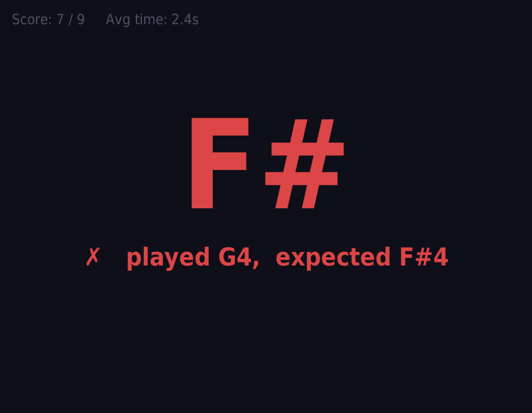
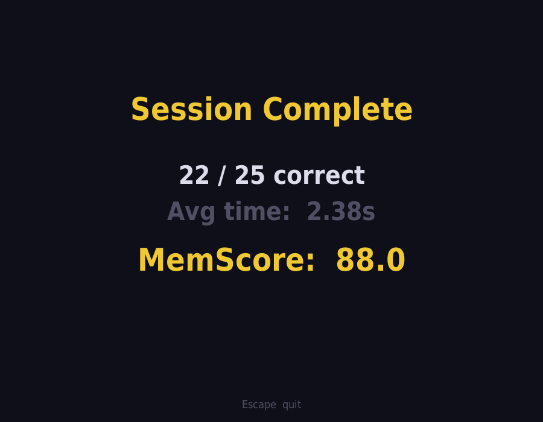

# MemBoard

A real-time guitar fretboard memorization trainer. MemBoard listens to your guitar through a microphone, shows you a note to find, and measures how fast and accurately you can locate it on the fretboard. Your sessions are logged and your personal bests are tracked.

---

## How It Works

1. **Pick a string** — practice one string at a time or all six
2. **Choose a round count** — 5 for a quick warm-up, up to 100 for a deep drill
3. **Play the note shown** — the app detects your pitch in real time
4. **See your result** — instant feedback with time taken, and a MemScore at the end

The display shows the **open note** of the string alongside the **target note** so you always know which string you're working on.

```
E  |  F#
```
*"On the high E string, find F#"*

---

## Screenshots

| Screen | Preview |
|---|---|
| Device selection |  |
| String selection |  |
| Round count + personal bests |  |
| Challenge — find the note |  |
| Result — correct |  |
| Result — wrong |  |
| Session complete |  |

---

## MemScore

MemScore is a single number combining accuracy and speed:

```
MemScore = (correct / total) × min(1, 3s / avg_time) × 100
```

A perfect score of **100** means you got every note right with an average response time of 3 seconds or faster. Your personal best per string and round count is shown before each session.

---

## Installation

**Requirements:** Python 3.12+

```bash
git clone https://github.com/hwasim6/memboard
cd memboard
pip install librosa numpy sounddevice pygame
python main.py
```

Or with [uv](https://github.com/astral-sh/uv):

```bash
uv sync
uv run main.py
```

---

## Controls

| Key | Action |
|---|---|
| `↑` / `↓` | Navigate menus |
| `Enter` | Confirm selection |
| `Escape` | Quit |

---

## Building a Standalone Executable

**Windows** — double-click `build.bat` or run from a terminal:

```bat
build.bat
```

The distributable is placed in `dist\MemBoard\`. Copy the entire folder to share the app — no Python required on the target machine.

> Cross-compilation is not supported. The build must be run on the target OS.

---

## Session Logs

Sessions are saved to CSV files inside a `log/` folder next to the executable:

```
log/
  all/rounds/25.csv      ← all-strings sessions, 25 rounds
  E/rounds/50.csv        ← E-string only, 50 rounds
  B/rounds/5.csv
  ...
```

Each row records the date, time, score, accuracy, average response time, and MemScore.

---

## Dependencies

| Package | Purpose |
|---|---|
| `sounddevice` | Real-time microphone input via PortAudio |
| `numpy` | FFT-based pitch detection (harmonic product spectrum) |
| `librosa` | Audio analysis utilities |
| `pygame` | GUI rendering |
